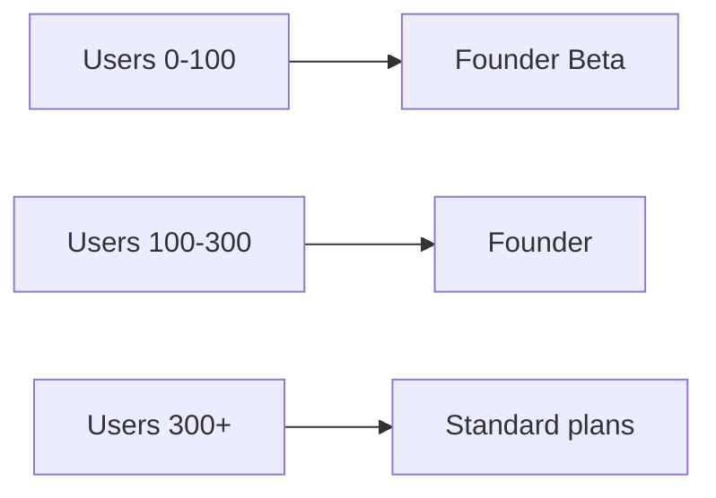

# Monetization Strategy

## Philosophy

**Never remove existing functionality from users who already rely on it.**

- Old value remains accessible (or grandfathered via founder snapshots)
- New value can become premium
- Limits and gates are introduced only when product-market fit is clear

## Current State (2026)

- **No payments**
- **No enforced limits**
- **All features enabled for everyone**
- Infrastructure only: `planType`, `features.ts`, `usage.ts`, `plans.ts`

## Pricing Tiers (Future)

| Plan | Monthly | Yearly | Notes |
| --- | ---: | ---: | --- |
| Founder | €2.99 | €29 | Lifetime pricing for early cohort |
| Unlimited | €6.99 | €69 | High-volume users |
| Pro | €9.99 | €89 | Advanced AI & warnings |
| Accountant | €29–99 | — | Multi-client, future |

Pricing is intentionally **lower initially** to:

- Reduce friction for early adopters in a small market (Latvia)
- Build habit and trust before asking for payment
- Learn usage patterns via analytics before setting limits

## Founder Cohorts

| Cohort | Size | Price (future) | Benefits |
| --- | --- | --- | --- |
| Founder Beta | 0–100 | Free → €29/year | Unlimited current features, lifetime price |
| Founder | 100–300 | €29/year | Same as above |
| Standard | 300+ | Pro / Unlimited / Free | Future tiers |

Stored in `src/lib/plans.ts` as `FOUNDER_COHORT_RULES`. **Enrolled automatically on signup** via `upsertUserByTelegramId()` — feature gates still off.

## Why Founders Do NOT Get All Future Features Forever

Promising unlimited future features creates a **monetization trap**:

- New AI capabilities have real API costs
- Accountant mode requires ongoing support
- Unlimited future access blocks sustainable pricing

Instead, founders receive:

1. **Lifetime access to features that existed when they joined** (`foundingFeatureSnapshotJson`)
2. **50% discount** on future premium features (`foundingDiscountPercent`)

## 50% Founder Discount Philosophy

Rewards early contribution without giving away the business model:

- Founders feel valued long-term
- New premium features remain viable
- Discount applies to **new** paid features, not automatic inclusion

## Implementation References

- Pricing config: `src/lib/plans.ts` → `PLAN_PRICING`
- Feature mapping: `src/lib/features.ts` → `PLAN_FEATURES`
- Enforcement flag: `ENFORCE_FEATURE_GATES = false`
