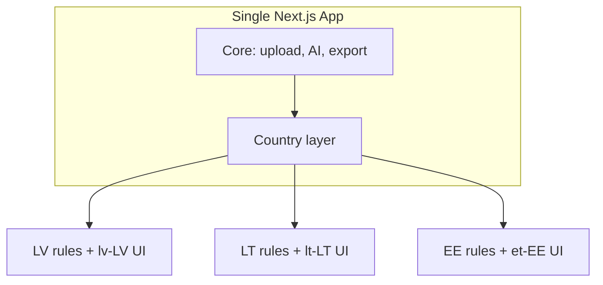

# Multi-Country Strategy

## Vision

One codebase, multiple Baltic products:

- **ReceiptBox LV** (live)
- **ReceiptBox LT** (planned)
- **ReceiptBox EE** (planned)

## Why Baltic-First?

- Similar market size and self-employed demographics
- Shared EUR currency
- Comparable pain: manual expense tracking before VID declaration
- Founder is based in Latvia and understands local workflows deeply

Latvia launches first because we can validate product-market fit with direct user access and local tax context.

## Architecture

**Single product. Single codebase. Country-specific rules layered on top.**

## Configuration

`src/config/countries.ts` defines per-country:

- Currency, locale, language
- Tax system identifier
- Theme color
- Enabled flag (only LV enabled today)

## User Country

`User.countryCode` defaults to `LV`. Future use:

- Country-specific tax logic
- Localized categories
- Branding via `getBrand()`

## Provider Interfaces

`src/lib/country/types.ts` defines:

- `ExpenseRulesProvider`
- `TaxRulesProvider`
- `DocumentCategoriesProvider`
- `CountryThemeProvider`

Implementations come at each country launch.

## Branding

`getBrand()` returns `ReceiptBox {CC}` with country theme color.

Icon system:

- Shared base icon (blue box + receipt + checkmark)
- Optional corner flag badge (LV / LT / EE)
- Assets in `/assets/branding/`

## Future Expansion

After Baltic validation:

- Poland, Germany, broader EU
- Requires new tax providers and localization
- Same feature/plan infrastructure applies

## Important

Multi-country support is **architecture only**. No LT/EE functionality is enabled. UI remains ReceiptBox LV for all users today.
